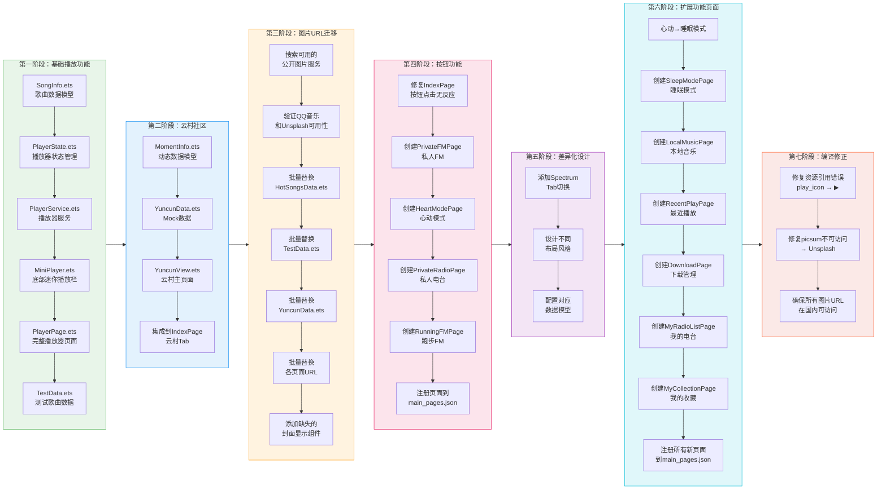

# 网易云音乐

Optimization project

## 鸿蒙 ArkTS 仿网易云音乐

- [api来源](https://github.com/Binaryify/NeteaseCloudMusicApi)
- [源码地址](https://github.com/linwu-hi/open_neteasy_cloud)

---

# 目录

1. [原版功能介绍](#原版功能介绍)
2. [开发顺序流程图](#开发顺序流程图)
3. [迭代新增功能](#迭代新增功能)
4. [技术栈](#技术栈)
5. [项目架构](#项目架构)
6. [页面路由与交互方式](#页面路由与交互方式)
7. [图片资源说明](#图片资源说明)
8. [原版修改说明](#原版修改说明)

---

## 原版功能介绍

- 登陆  首页  每日推荐  歌单广场  排行榜  云村热评  视频  MV详情页  我的
- 电台模块【电台首页，电台详情, 电台排行榜】  搜索【支持单曲，MV，专辑，歌单，电台】  播放页【歌词，播放列表，上一首，下一首】

## 部分功能效果图


---

## 开发顺序流程图




---

## 迭代新增功能

> **新增差异说明**：以下所有章节（迭代新增功能、技术栈、项目架构、页面路由与交互方式、图片资源说明）均为全新编写内容。

### 一、"我的"页面功能扩展

#### 1.1 按钮区扩展（由4个扩展至5个）


| 按钮   | 跳转页面             | 说明      |
| ---- | ---------------- | ------- |
| 私人FM | PrivateFMPage    | 原版已有，保留 |
| 心动模式 | HeartModePage    | 原版已有，保留 |
| 私人电台 | PrivateRadioPage | 原版已有，保留 |
| 跑步FM | RunningFMPage    | 原版已有，保留 |
| 睡眠模式 | SleepModePage    | 新增按钮    |


#### 1.2 列表区功能实现


| 列表项  | 跳转页面             | 状态       |
| ---- | ---------------- | -------- |
| 本地音乐 | LocalMusicPage   | 添加点击跳转功能 |
| 最近播放 | RecentPlayPage   | 添加点击跳转功能 |
| 下载管理 | DownloadPage     | 添加点击跳转功能 |
| 我的电台 | MyRadioListPage  | 添加点击跳转功能 |
| 我的收藏 | MyCollectionPage | 添加点击跳转功能 |


### 二、新增子页面详细设计

每个新增页面均采用 **Spectrum滑动切换** 或 **Tab切换** 设计，每个子页面拥有不同的布局风格，避免同质化。

#### 2.1 私人FM（PrivateFMPage）


| Spectrum | 布局风格          | 特色元素                 | 图片源      |
| -------- | ------------- | -------------------- | -------- |
| 私人播客     | 横向卡片列表（保留原设计） | 封面+标题+描述+期数+播放按钮     | Unsplash |
| 推荐电台     | 2列网格布局        | LIVE标签+分类色块+半透明播放按钮  | Unsplash |
| 有声书      | 书架式列表         | 竖版封面+章节进度条+评分⭐+分类标签  | Unsplash |
| 相声评书     | 传统曲艺风格        | 圆形艺人头像+经典推荐横向滚动+类型标签 | Unsplash |


#### 2.2 心动模式（HeartModePage）


| Spectrum | 布局风格          | 特色元素                 | 图片源      |
| -------- | ------------- | -------------------- | -------- |
| 心动推荐     | 大封面播放器（保留原设计） | 心动指数❤+歌词预览+滑块进度条     | Unsplash |
| 甜蜜情歌     | 情绪标签+列表       | 6种情绪筛选+歌词斜体预览+时长     | Unsplash |
| 治愈轻音乐    | 场景卡片网格（2列）    | 场景标签+播放覆盖层+描述文字      | Unsplash |
| 心动排行榜    | 排名展示          | 前三名金银铜徽章+趋势箭头↑↓+播放次数 | Unsplash |


#### 2.3 私人电台（PrivateRadioPage）


| Spectrum | 布局风格        | 特色元素                 | 图片源      |
| -------- | ----------- | -------------------- | -------- |
| 我的电台     | 列表布局（保留原设计） | LIVE标签+收听人数+圆形播放按钮   | Unsplash |
| 播客订阅     | 横向卡片+列表混合   | 最近更新横向滚动+全部播客列表+更新时间 | Unsplash |
| 有声书库     | 3列书架网格      | 竖版封面+阅读进度百分比+演播者信息   | Unsplash |
| 音乐分类     | 2列彩色网格      | 半透明彩色覆盖+分类名+歌曲数量     | Unsplash |


#### 2.4 跑步FM（RunningFMPage）


| Spectrum | 布局风格            | 特色元素                 | 图片源      |
| -------- | --------------- | -------------------- | -------- |
| 跑步音乐     | BPM控制+歌单（保留原设计） | BPM滑块±调节+跑步状态统计+歌曲列表 | Unsplash |
| 训练计划     | 卡片列表            | 难度标签（颜色区分）+时长/距离/卡路里 | Unsplash |
| 运动记录     | 统计卡片+多列列表       | 本周统计+距离/卡路里/配速/BPM展示 | NA       |
| 音乐风格     | 2列彩色网格          | 半透明彩色覆盖+BPM范围+歌曲数量   | Unsplash |


#### 2.5 睡眠模式（SleepModePage）


| Spectrum | 布局风格     | 特色元素                           | 图片源      |
| -------- | -------- | ------------------------------ | -------- |
| 助眠音乐     | 定时器+歌曲列表 | 定时关闭（±5分钟步长）+类型标签+播放控制         | Unsplash |
| 睡前故事     | 故事列表     | 分类标签+旁白播讲者+时长                  | Unsplash |
| 白噪音      | 3列场景网格   | 6种白噪音（雨声/海浪/森林/篝火/风声/溪流）+播放覆盖层 | Unsplash |
| 冥想引导     | 引导列表     | 放松/冥想/感恩分类+引导老师+时长             | Unsplash |


#### 2.6 本地音乐（LocalMusicPage）


| Tab | 布局风格    | 特色元素                     | 图片源  |
| --- | ------- | ------------------------ | ---- |
| 单曲  | 序号+封面列表 | 序号+50x50封面+歌名/歌手-专辑+文件大小 | QQ音乐 |
| 歌手  | 圆形头像列表  | 50x50圆形头像+歌手名+歌曲数        | QQ音乐 |
| 专辑  | 2列网格    | 方形封面+专辑名+歌手名             | QQ音乐 |
| 文件夹 | 文件夹列表   | 📁图标+文件夹名+歌曲数            | NA   |


#### 2.7 最近播放（RecentPlayPage）


| Tab | 布局风格    | 特色元素               | 图片源      |
| --- | ------- | ------------------ | -------- |
| 歌曲  | 序号+封面列表 | 播放时间+播放次数+清空记录按钮   | QQ音乐     |
| 视频  | 视频卡片列表  | 120x70视频封面+播放按钮覆盖层 | Unsplash |
| 歌单  | 方形封面列表  | 60x60封面+歌单名+歌曲数    | Unsplash |
| 专辑  | 2列网格    | 方形封面+专辑名+歌手名       | QQ音乐     |


#### 2.8 下载管理（DownloadPage）


| Tab  | 布局风格   | 特色元素                     | 图片源      |
| ---- | ------ | ------------------------ | -------- |
| 下载中  | 进度条列表  | 下载进度条+百分比+大小/总大小+暂停按钮    | QQ音乐     |
| 已下载  | 歌曲列表   | 50x50封面+歌名/歌手+文件大小+播放按钮  | QQ音乐     |
| 下载视频 | 视频卡片列表 | 120x70视频封面+播放按钮覆盖层+已下载标签 | Unsplash |


#### 2.9 我的电台（MyRadioListPage）


| Tab  | 布局风格      | 特色元素                  | 图片源      |
| ---- | --------- | --------------------- | -------- |
| 全部电台 | 卡片列表+管理按钮 | LIVE标签+分类标签+收听人数+更新时间 | Unsplash |
| 正在直播 | 直播筛选列表    | 仅显示isLive=true的电台     | Unsplash |
| 订阅更新 | 订阅筛选列表    | 仅显示isLive=false的电台    | Unsplash |


#### 2.10 我的收藏（MyCollectionPage）


| Tab | 布局风格    | 特色元素                           | 图片源      |
| --- | ------- | ------------------------------ | -------- |
| 歌曲  | 序号+封面列表 | 序号+50x50封面+歌名/歌手+播放全部按钮+圆形播放按钮 | QQ音乐     |
| 歌单  | 2列网格    | 方形封面+歌单名+歌曲数                   | Unsplash |
| 专辑  | 2列网格    | 方形封面+专辑名+歌手名                   | QQ音乐     |
| 艺人  | 3列网格    | 方形封面+艺人名+歌曲数                   | QQ音乐     |


### 三、云村社区功能

#### 3.1 YuncunView（云村主页面）

- 采用 **Swiper左右滑动** 设计，分为"关注"和"推荐"两个子页面
- **关注Tab**：显示已关注用户的动态和状态
- **推荐Tab**：显示明星用户（周杰伦等）的动态内容
- 动态内容支持多种类型：文字动态、图片动态（Grid网格）、音乐卡片、视频卡片
- 时间格式化（刚刚/n分钟前/n小时前/n天前）
- 数字格式化（1.2w、1.5k等）
- 动态操作栏（点赞、评论、分享）

#### 3.2 数据模型


| 文件             | 内容                              |
| -------------- | ------------------------------- |
| MomentInfo.ets | 动态信息（用户信息、动态类型、内容、图片、音乐、视频、时间等） |
| YuncunData.ets | Mock数据生成（明星用户、普通用户、关注动态、推荐动态）   |


### 四、UI组件增强


| 组件            | 位置        | 功能                               |
| ------------- | --------- | -------------------------------- |
| MiniPlayer    | 底部常驻      | 迷你播放栏，显示当前歌曲封面/歌名/歌手，播放/暂停/下一首控制 |
| PlayListView  | 播放列表弹窗    | 歌曲序号+封面+歌名/歌手，当前播放高亮红色           |
| RecommendView | 首页"推荐"Tab | 推荐歌单+新歌速递+热门歌手+推荐歌曲列表（均含封面）      |
| GestureBack   | 手势返回区域    | 左侧滑动返回上一页                        |


### 五、图片URL全面更新

所有图片URL已从不可用的网易云音乐防盗链图片替换为以下服务：


| 图片服务     | 域名                    | 用途                  | 状态     |
| -------- | --------------------- | ------------------- | ------ |
| QQ音乐     | `y.gtimg.cn`          | 歌曲专辑封面、歌手头像         | ✅ 国内可用 |
| Unsplash | `images.unsplash.com` | 占位图片、背景图、电台/播客/分类封面 | ✅ 国内可用 |


**更新的数据文件：**

- `HotSongsData.ets`：50首热门歌曲封面 + 10个歌手头像
- `TestData.ets`：测试歌曲封面
- `YuncunData.ets`：云村数据中的用户头像

**添加封面显示的界面：**

- `PlayListView.ets`：播放列表中每首歌曲前添加44x44封面
- `PlaylistDetailPage.ets`：歌单歌曲列表添加48x48封面
- `RecommendView.ets`：推荐歌曲列表添加48x48封面

---

## 技术栈


| 层级       | 技术                    | 说明                                        |
| -------- | --------------------- | ----------------------------------------- |
| **开发框架** | HarmonyOS ArkTS       | 华为鸿蒙官方声明式UI框架                             |
| **编程语言** | ArkTS (TypeScript超集)  | 鸿蒙原生开发语言                                  |
| **构建工具** | Hvigor                | 鸿蒙原生构建工具链                                 |
| **包管理**  | ohpm                  | 鸿蒙原生包管理器                                  |
| **UI组件** | ArkUI声明式组件            | Column/Row/Flex/Stack/Scroll/Swiper/Grid等 |
| **路由**   | @ohos.router          | 页面间跳转（pushUrl/back）                       |
| **状态管理** | @State/@Prop/@Builder | 组件状态驱动UI更新                                |
| **网络请求** | @ohos.net.http        | HTTP请求获取音频资源                              |
| **媒体播放** | AVPlayer              | 鸿蒙多媒体播放框架                                 |
| **图片加载** | Image组件 + objectFit   | 网络图片显示，支持Cover/Fill等                      |
| **手势交互** | PanGesture            | 手势返回（左滑返回上一页）                             |


### 项目文件结构

```
entry/src/main/ets/
├── common/
│   ├── bean/           # 数据模型
│   │   ├── Category.ets
│   │   ├── ListItemData.ets
│   │   ├── LyricInfo.ets
│   │   ├── MomentInfo.ets       # 动态信息模型
│   │   ├── PlayerState.ets
│   │   └── SongInfo.ets
│   ├── constants/      # 常量/数据
│   │   ├── CommonConstants.ets
│   │   ├── HotSongsData.ets     # 热门歌曲数据（图片URL已更新）
│   │   ├── TestData.ets         # 测试数据（图片URL已更新）
│   │   └── YuncunData.ets       # 云村Mock数据
│   ├── service/        # 服务层
│   │   ├── LyricParser.ets
│   │   ├── PlayerService.ets
│   │   ├── RecommendService.ets
│   │   └── SearchHistoryService.ets
│   └── state/
│       └── PlayerStore.ts
├── entryability/
│   └── EntryAbility.ts
├── pages/             # 页面（17个页面）
│   ├── HomePage.ets              # 原版
│   ├── IndexPage.ets            # 首页（按钮/列表点击已更新）
│   ├── DailyRecommendPage.ets   # 原版
│   ├── ProfilePage.ets          # 图片URL已更新
│   ├── PlayerPage.ets           # 原版播放器
│   ├── PlaylistDetailPage.ets   # 添加封面显示
│   ├── SearchPage.ets           # 原版搜索
│   ├── PrivateFMPage.ets        # 私人FM
│   ├── HeartModePage.ets        # 心动模式
│   ├── PrivateRadioPage.ets     # 私人电台
│   ├── RunningFMPage.ets        # 跑步FM
│   ├── SleepModePage.ets        # 睡眠模式
│   ├── LocalMusicPage.ets       # 本地音乐
│   ├── RecentPlayPage.ets       # 最近播放
│   ├── DownloadPage.ets          # 下载管理
│   ├── MyRadioListPage.ets      # 我的电台
│   └── MyCollectionPage.ets     # 我的收藏
├── view/              # 可复用UI组件
│   ├── CategoryComponent.ets
│   ├── DetailListComponent.ets
│   ├── GestureBack.ets
│   ├── LyricView.ets
│   ├── MiniPlayer.ets           # 底部迷你播放栏
│   ├── PlayListView.ets          # 播放列表（添加封面显示）
│   ├── PlayerContainer.ets
│   ├── RecommendView.ets        # 推荐视图（添加封面显示）
│   └── YuncunView.ets           # 云村社区主页
└── viewmodel/
    └── PageViewModel.ets
```

---

## 页面路由与交互方式

### 页面路由图

```
IndexPage (首页 - 底部Tab导航)
├── [推荐] Tab → RecommendView
│   ├── Banner → PlaylistDetailPage
│   ├── 推荐歌单 → PlaylistDetailPage
│   ├── 新歌速递 → DailyRecommendPage
│   ├── 搜索框 → SearchPage
│   └── 歌曲列表 → PlayerPage (via MiniPlayer)
├── [云村] Tab → YuncunView
│   ├── [关注] → 关注动态列表
│   └── [推荐] → 明星推荐动态列表
├── [我的] Tab
│   ├── 按钮区
│   │   ├── 私人FM → PrivateFMPage (4个spectrum)
│   │   ├── 心动模式 → HeartModePage (4个spectrum)
│   │   ├── 私人电台 → PrivateRadioPage (4个spectrum)
│   │   ├── 跑步FM → RunningFMPage (4个spectrum)
│   │   └── 睡眠模式 → SleepModePage (4个spectrum)
│   ├── 列表区
│   │   ├── 本地音乐 → LocalMusicPage (4个Tab)
│   │   ├── 最近播放 → RecentPlayPage (4个Tab)
│   │   ├── 下载管理 → DownloadPage (3个Tab)
│   │   ├── 我的电台 → MyRadioListPage (3个Tab)
│   │   └── 我的收藏 → MyCollectionPage (4个Tab)
│   └── 创建歌单 → PlaylistDetailPage
└── [MiniPlayer] → PlayerPage (点击弹出全屏播放器)
```

### 交互方式


| 交互类型           | 实现方式                          | 说明                       |
| -------------- | ----------------------------- | ------------------------ |
| **Tab切换**      | 底部Tab + onClick               | 首页推荐/云村/我的切换             |
| **Spectrum滑动** | Scroll + Horizontal + onClick | 子页面分类切换（私人播客、推荐电台等）      |
| **Tab标签**      | Row + onClick + 状态色           | 下载管理/最近播放等页面的分类Tab       |
| **页面跳转**       | router.pushUrl()              | 按钮点击跳转至子页面               |
| **手势返回**       | PanGesture → router.back()    | 左侧80px区域右滑返回上一页          |
| **播放控制**       | 文本符号 + onClick                | ⏮上一首 / ▶播放 / ⏸暂停 / ⏭下一首  |
| **进度条**        | Slider组件                      | 音乐播放进度、下载进度、有声书阅读进度      |
| **BPM调节**      | ±按钮 + Slider                  | 跑步FM节奏调节（60-200 BPM，步长5） |
| **定时器**        | ±按钮 + Button                  | 睡眠模式定时关闭（5-120分钟，步长5）    |
| **列表点击**       | onClick + 状态色                 | 选中歌曲高亮红色                 |


---

## 图片资源说明

### 使用的图片服务


| 服务       | 域名                    | 格式示例                                                         | 用途                    |
| -------- | --------------------- | ------------------------------------------------------------ | --------------------- |
| QQ音乐     | `y.gtimg.cn`          | `https://y.gtimg.cn/music/photo_new/T002R300x300M000...jpg`  | 歌曲专辑封面（50首）、歌手头像（10个） |
| Unsplash | `images.unsplash.com` | `https://images.unsplash.com/photo-...?w=200&h=200&fit=crop` | 占位图片、电台封面、分类封面、背景图    |


### 图片问题修复历程

1. **网易云音乐防盗链** → `p1.music.126.net` 图片无法加载
2. **第一次替换** → 使用 `y.gtimg.cn`（QQ音乐）成功
3. **补充占位图** → 使用 `picsum.photos`
4. **picsum被墙** → `picsum.photos` 在国内无法访问
5. **最终方案** → 全部替换为 `images.unsplash.com` ✅

### 本地资源图标


| 资源                       | 用途         |
| ------------------------ | ---------- |
| `app.media.ic_back`      | 返回按钮       |
| `app.media.more_menu`    | 更多菜单按钮     |
| `app.media.my_nav_icon1` | "我的"页面按钮图标 |
| `app.media.music_icon`   | 音乐列表项图标    |
| `app.media.icon`         | 应用图标       |


> 注：播放控制图标（play_icon、pause_icon、previous_icon、next_icon）因资源文件缺失，已改用emoji文本符号（▶⏸⏮⏭）替代。

---

## 原版修改说明

为了能在虚拟机中正常运行，在升级功能之前，对原版代码进行了如下安全性修改：

### 1. 类属性初始化问题 (4个错误)

ListItemData.ets: 将 title、summary、imageArrow 改为可选属性 (?)
Category.ets: 将 title、categoryContent 改为可选属性 (?)

### 2. 类型安全问题 (3个错误)

DetailListComponent.ets: 为 ForEach 回调参数添加显式类型声明
HomePage.ets: 修复路由参数访问，使用 Record<string, Object> 类型
IndexPage.ets: 同样修复路由参数访问方式
DailyRecommendPage.ets: 同样修复路由参数访问方式

## 虚拟机录频01

展示了原版项目在虚拟机上运行的录频。

---

### **持续更新中...**

